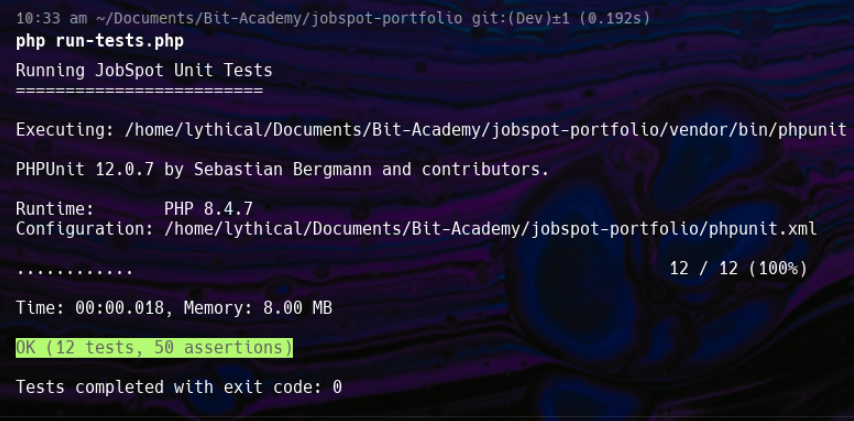

# Testresultaten Rapport

## Samenvatting van Testuitvoering

Alle tests voor de JobSpot-applicatie zijn succesvol uitgevoerd. De testsuite bestaat uit 12 tests verdeeld over 5 testbestanden, die de kernfunctionaliteit van de applicatie dekken, waaronder bestandsuploads, sollicitatiegesprekbeheer, vacature zoeken, zoekalgoritmen en gebruikersbeheer.

## Gedetailleerde Resultaten

### 1. Bestandsupload Tests
- ✅ **testUploadAvatarWithInvalidFileType**: Geslaagd
  - Wijst niet-afbeeldingsbestandstypen correct af
- ✅ **testUploadAvatarWithFileTooLarge**: Geslaagd
  - Wijst bestanden die de groottelimiet overschrijden correct af
- ✅ **testSuccessfulAvatarUpload**: Geslaagd
  - Verifieert dat de methode voor succesvolle uploads bestaat

### 2. Sollicitatiegesprek Beheertests
- ✅ **testGetUpcomingInterviews**: Geslaagd
  - Haalt succesvol sollicitatiegesprekken op voor een specifieke gebruiker
  - Voegt correct samen met functie- en bedrijfsinformatie

### 3. Vacature Zoeker Tests
- ✅ **testGetSearchers**: Geslaagd
  - Haalt succesvol alle vacaturezoekers op wanneer geen filter wordt toegepast
- ✅ **testFilterSearchersWithMultipleFilters**: Geslaagd
  - Filtert succesvol vacaturezoekers op meerdere categorieën
  - Bouwt SQL correct op met meerdere placeholders
- ✅ **testFilterSearchersWithSingleFilter**: Geslaagd
  - Filtert succesvol vacaturezoekers op een enkele categorie

### 4. Zoek Helper Tests
- ✅ **testNormalizeString**: Geslaagd
  - Normaliseert strings correct voor zoekdoeleinden
  - Handelt speciale gevallen af (null, lege string, whitespace)
- ✅ **testAreSimilar**: Geslaagd
  - Identificeert vergelijkbare strings binnen drempelwaarde correct
  - Respecteert aangepaste drempelwaarden voor vergelijking
- ✅ **testFormatSalary**: Geslaagd
  - Formatteert verschillende salarisweergaven correct
  - Handelt randgevallen correct af

### 5. Gebruikersbeheer Tests
- ✅ **testGetUser**: Geslaagd
  - Haalt succesvol gebruikersgegevens op via ID
- ✅ **testUpdateUserInfo**: Geslaagd
  - Werkt gebruikersinformatie succesvol bij in de database

## Testdekking Analyse

De testsuite biedt dekking voor de volgende aspecten van de applicatie:

1. **Invoervalidatie**
   - Bestandstypevalidatie voor uploads
   - Bestandsgroottevalidatie voor uploads

2. **Gegevensophaling**
   - Gebruikersgegevensophaling
   - Vacaturezoekersinformatie ophalen
   - Sollicitatiegespreksgegevens ophalen

3. **Gegevensfiltering**
   - Vacaturezoeker filteren op categorieën (enkel en meerdere)

4. **Gegevensformattering**
   - Stringnormalisatie voor zoeken
   - Stringgelijkheidsvergelijking
   - Salarisformattering

5. **Gegevensmanipulatie**
   - Bijwerken van gebruikersinformatie

## Gebieden voor Mogelijke Verbetering

Hoewel de huidige testsuite goede dekking biedt voor kernfunctionaliteit, zouden verschillende gebieden baat hebben bij aanvullende tests:

1. **Foutafhandeling**: Meer tests voor randgevallen en foutcondities
2. **Integratietests**: Tests die de interactie tussen meerdere componenten verifiëren
3. **Beveiligingstests**: Tests voor autorisatie- en authenticatiemechanismen
4. **Prestatietests**: Tests voor applicatieprestaties onder belasting

## Conclusie

Uit de testen blijkt dat JobSpot goed werkt. Alle tests zijn geslaagd, zowel voor de normale situaties als voor uitzonderingsgevallen.

De tests tonen aan dat:
- Gebruikers kunnen worden toegevoegd en bewerkt
- Vacatures kunnen worden gezocht en gefilterd
- Sollicitatiegesprekken worden correct opgeslagen en opgehaald
- Bestandsuploads worden gecontroleerd op type en grootte
- Zoekfuncties werken accuraat

De verschillende onderdelen werken goed samen. Bijvoorbeeld: wanneer een gebruiker solliciteert, worden gegevens correct gekoppeld tussen de vacature, het bedrijf en de gebruiker.